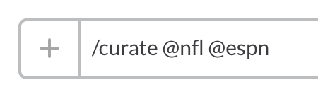
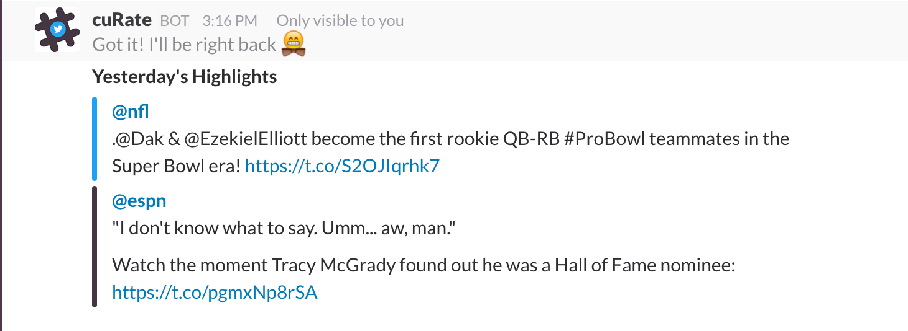

#slack-curate

#####*21 Dec 2016*

***
##Overview

Curate is a slash command that brings yesterday's news and highlights from your twitter feed to your channel. A bite sized tweet curator that helps you stay in the-know and keeps it seamless by never having to leave your slack environment.

Curate finds the yesterday's most popular tweet by each specified handle, scored based on number of favorites and retweets, and returns to your slack channel. 




##  Setup
1. Create a Slack [slash command][slack-command] integration. After clicking 'Add Integration', scroll to 'Integration Settings' and note the token provided. Before we proceed, let's complete steps 2 and 3.
2. Create a Twitter [bot][twitter-bot] and leave placeholder text when prompted for a website url. Click create and select the "Keys and Access Tokens" tab. Note the 'Consumer Key', 'Consumer Secret', 'Access Token', and 'Access Token Secret'. 
3. Next, lets deploy slack-curate on Heroku (of course you may use your own web host if you'd like). To deploy `slack-curate` on Heroku, I recommend using this button to create your own copy of `slack-curate` (Use the tokens we have generated to fill out of the necessary fields):

[](https://heroku.com/deploy?template=https://github.com/armaanshah96/slack-curate)

If you prefer manually deploying (assumes [Heroku CLI Toolbelt][toolbelt] is installed and that you have a [Heroku Account][heroku-account]):
```sh
  $ git clone git@github.com:armaanshah96/slack-curate.git && cd slack-curate
  $ npm install
  $ heroku login
    (^^Follow password instructions)
  $ heroku create
  $ git push heroku master
  $ heroku open
```

After deploying (manually or by button), note the URL endpoint that Heroku provides (i.e. https://enigma-forest-12345.herokuapp.com/ - this is not, i hope, an actual link to something)


4. Now return to the slack slash command integration and add the URL endpoint under "Integration Settings". Make sure that the 'METHOD' field is set to POST. Otherwise, optionally fill out other fields on the page. Once you are done click 'Save Integration'


## Settings
Unless you used the Heroku button, each of the tokens that you have taken note of will need to be configured if you have manually deployed on heroku. One way to do that is by creating and filling out those fields in the 'Settings' under 'Config' of your heroku dashboard in the browser.

- `SLACK_TOKEN` 
- `TWITTER_CONSUMER_KEY`
- `TWITTER_CONSUMER_SECRET`
- `TWITTER_TOKEN`
- `TWITTER_TOKEN_SECRET`

## Future Releases
Ideally, a command (i.e. /curate_daily) that sends daily highlights without the manual command will be made available (possibly in a full app integration). For now see [cuRate][curate-r] if you'd like an automated incoming webhook to send you daily highlights.

A /curate_watch command that sends a webhook to your channel when (a) specific twitter handle(s) hit(s) a threshold score. Be notified of something very important that is happening right away.

## Notes
Please, feel free to submit pull requests and contribute. One potentially important use case of slack-curate could be for a startup that works through slack. Being quickly updated about the basic information in your industry could be valuable and time efficient. Wake up in the morning and get an idea of any important news before you even start working.

## License

MIT © [Armaan Shah](http://armaanshah.me)

[twitter-bot]: https://apps.twitter.com/app/new
[slack-command]: https://my.slack.com/services/new/slash-commands
[toolbet]: https://devcenter.heroku.com/articles/heroku-cli
[heroku-account]: https://signup.heroku.com/
[curate-r]: https://github.com/armaanshah96/cuRate